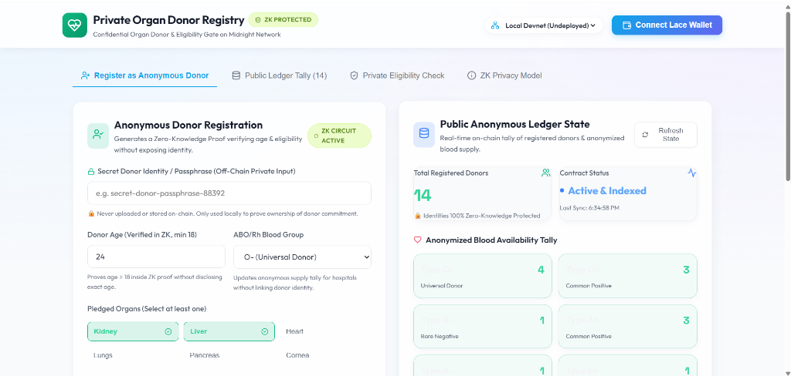
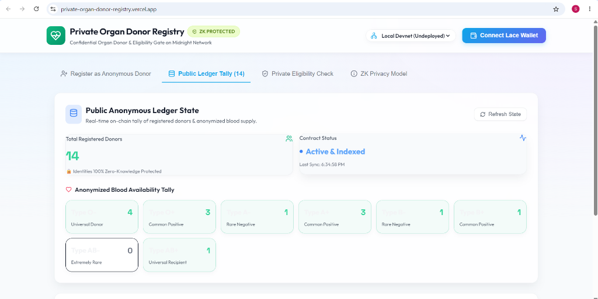

# Private Organ Donor Registry

A privacy-preserving zero-knowledge organ donor registry built on the Midnight Network using Compact smart contracts.

## Contract Address

| Network | Contract Address |
|---------|------------------|
| Preprod | `<YOUR_DEPLOYED_CONTRACT_ADDRESS>` |

## Features
- **Anonymous Donor Registration**: Register as an organ donor without revealing your identity on the public ledger.
- **ZK Age Verification**: Prove you are over 18 without revealing your exact age.
- **Anonymized Blood Availability Tally**: Track the total availability of various blood types globally without compromising the privacy of the individual donors.
- **Lace Wallet Integration**: Seamless, secure authentication using the Midnight Lace Wallet extension.

## What This Project Does
This project enables individuals to securely pledge their organs for donation while maintaining strict privacy. Because of Midnight's zero-knowledge proofs, hospitals can see an aggregated view of the available blood types and pledged organs, but the individual identities, exact ages, and sensitive data of the donors are protected and cannot be linked to the public ledger data by an outside observer.

## Privacy Model
**What an Observer CANNOT Learn (Private Information):**
- **Raw Donor Passphrase / Identity**: The secret donor passphrase is executed purely in local ZK witnesses and never transmitted to the network or stored in public state.
- **Precise Donor Age**: Age verification (> 18) happens inside local ZK circuit constraints. The exact age is never revealed.
- **Individual Organ Pledges**: Which specific user pledged which specific organs remains hidden from observers.

**What an Observer CAN Learn (Public Information):**
- **Verified Total Donors**: The aggregate counter tracking the total number of registered donors.
- **Anonymized Blood Availability Tally**: The system tallies public counts of available blood types (e.g., Type O-, Type A+) to help medical institutions.
- **Cryptographic Commitment Hash**: The disclosed persistent hash commitment representing a mathematically proven registration event.

## Tech Stack
- **Smart Contract**: Compact (Midnight Network)
- **Frontend**: React, TypeScript, Vite
- **Wallet**: Midnight Lace Wallet
- **Styling**: Vanilla CSS (SaaS theme)
- **Testing**: Vitest

## Folder Structure
```
private-organ-donor-registry/
├── contracts/             # Contains organ-donor-registry.compact smart contract
├── frontend/              # React frontend application
├── src/                   # Deployment and setup scripts
├── assets/                # Screenshots and images
├── test/                  # Automated tests
└── package.json           # Root project dependencies
```

## Prerequisites
- **Node.js**: v22
- **Docker**: Installed and running (for the proof server)
- **Midnight Lace Wallet**: Installed in your browser

## Installation
Clone the repository:
```bash
git clone https://github.com/sourasishbhaduri/private-organ-donor-registry.git
cd private-organ-donor-registry
```

Install root dependencies:
```bash
nvm use 22
npm install
```

Install frontend dependencies:
```bash
cd frontend
npm install
cd ..
```

## Build
Build the project:
```bash
npm run build
```

## Compile
Start the Midnight Proof Server container:
```bash
docker run -d -p 6300:6300 midnightntwrk/proof-server:8.1.0
```

Compile the Compact contract:
```bash
npm run compile
```

## Manual Deployment
Deployment is intentionally skipped so you can deploy the contract using your own credentials.
Execute the following deployment command manually:
```bash
NODE_OPTIONS="--max-old-space-size=12288" npm run deploy -- --network preprod
```

## After Deployment
The only remaining manual steps are:
1. Deploy the Compact contract.
2. Copy the deployed contract address.
3. Replace every occurrence of:
`<YOUR_DEPLOYED_CONTRACT_ADDRESS>`
with your deployed contract address in the `.env` and `README.md` files.

## Environment Variables
Create a `.env` file in the root of the project:
```env
CONTRACT_ADDRESS=<YOUR_DEPLOYED_CONTRACT_ADDRESS>
```

## Screenshots



## Initial Idea
[PASTE YOUR PROJECT IDEA HERE]

## Troubleshooting
- **Lace Wallet not connecting**: Ensure the extension is unlocked and on the Preprod network.
- **Proof server errors**: Make sure Docker is running and port 6300 is exposed.
